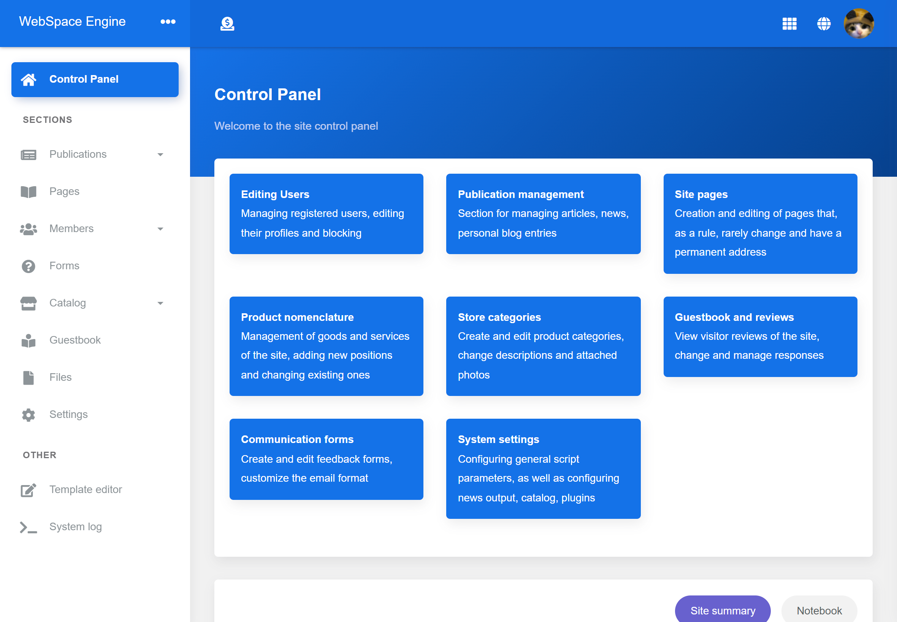

## WebSpace Engine
[Website](https://getwebspace.org/) |
[Documentation](https://github.com/getwebspace/platform/wiki) |
[Official Repository](https://github.com/getwebspace/platform) |
[Doker template](https://github.com/getwebspace/platform-template) |
[Demo shop](https://demo.getwebspace.org)

WSE is a free open source multi-user site engine with great functionality, primarily intended for: organization of mass media; blogs; online stores;



## Features
- Templates in Twig
- Template editor
- Plugins API
- HTTP API (dedicated API, and each public controller as API)
- Docker compatible
- Publications
- Static pages
- Catalog of products (shop)
- Dynamic forms
- Guestbook
- Users and User groups with permissions
- User mailing list
- SMTP & SendPulse
- reCAPTCHA
- OAuth (facebook, vk)
- Files and image optimization (imagemagick)
- Background tasks

and more..

## Plugins
- Search optimization (robots.txt, sitemap, Yandex.Market, Google Merchant)
- TradeMaster

## Languages
- English (default)
- Ukrainian (plugin)
- Russian (plugin)

## Roadmap

- new attributes

## Installation
#### Production mode
[Installation instructions](https://github.com/getwebspace/platform/wiki/Installation-(Docker)) from Docker template [getwebspace/platform-template](https://github.com/getwebspace/platform-template)

#### Developer mode
Use docker by running the command: `docker-compose up -d`, then open `http://localhost:9000`

#### Environment variables
You can define the next environment variables

| Type    | Variable Name      | Default        | description                                                       |
|---------|--------------------|----------------|-------------------------------------------------------------------|
| Build   | BUILD_DEPENDENSIES |                | Dependencies used in the build                                    |   
| Build   | DEPENDENSIES       | ''             | Core Libraries                                                    |   
| Build   | EXTRA_EXTENSIONS   | pdo_mysql      | Additional Libraries                                              |   
| Build   | PLATFORM_HOME      | /var/container | Home directory                                                    |   
| Runtime | DEBUG              | 0              | Debug Mode                                                        |   
| Runtime | DATABASE           |                | PDO Database params (default: sqlite)                             |   
| Runtime | SIMPLE_PHONE_CHECK | 0              | Checking the user's phone number for compliance with the standard |   

#### Install dependencies
```shell script
./composer install
```

#### Static analyzer
```shell script
./phpcs
```

#### Unit tests
```shell script
./phpunit [..]
```

#### After run
Check chmod's

```shell script
chmod -R 0777 plugin
chmod -R 0777 theme
chmod -R 0777 var
chmod -R 0776 var/upload
```

## License
Licensed under the MIT license. See [License File](LICENSE.md) for more information.
